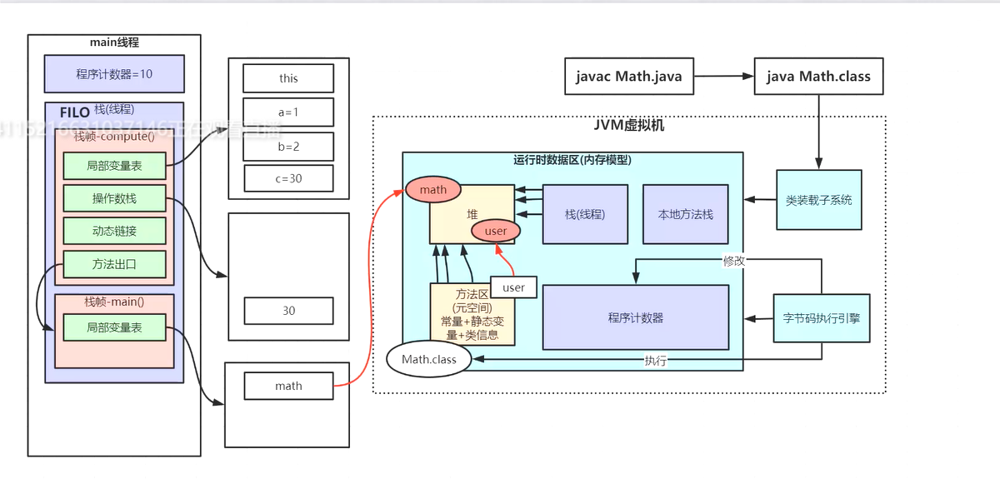

## JVM java虚拟机
优点:

    跨平台、内存自动管理有垃圾回收机制、数组下标越界检测、多态

比较：JVM、JRE、JDK、javaSE、javaEE

    JVM
    JRE ： JVM + 基础类库
    JDK ： JVM + 基础类库 + 编译工具
    开发javaSE程序 ： JDK + IDE工具
    开发javaEE程序 ： JDK + 应用服务器 + IDE工具

常见的JVM：
openJDK、

****

**内存结构：
程序计数器、虚拟机栈、堆、本地方法栈、方法区**

程序计数器（寄存器）：
> 作用：记住下一次jvm指令的执行地址
> 
> 特点：
> 
> 线程私用（每个线程都有自己的计数器）、不会内存溢出

> jvm指令执行过程：jvm指令->解释器->机器码->CPU

虚拟机栈：
> 每调用一个方法，就会压一个栈帧进虚拟机栈，主方法也算。所以可以理解为：每个线程运行所需的内存
> 
> 特点：线程私有
> 
> 存放：
> 
> JVM只会直接对JavaStack（Java栈）执行两种操作：①以帧为单位的压栈或出栈；②通过-Xss来设置， 若不够会抛出StackOverflowError异常。

~~~
/**
 * 用于理解虚拟机栈
 *
 * 设置断点到method1()这行，debug执行，逐步执行（步入）
 * 可以看到下面栈的情况：先压入(栈帧)main方法、method1、method2，然后出栈method2、method1、回到main方法。
 * 弹出栈后，方法内存就会被释放
 * 这个不需要GC垃圾回收
 *
 */

class A{
    int a;
}

public class jvmDemo1 {
    public static void main(String[] args) {
        method1();
    }
    public static void method1(){
        A a = new A();
        A b = new A();
        b = a;
        a = null;
        b = null;
        //这里虽然会出现内存泄漏，但是按照黑马讲解JVM中说，这方法的内存属于栈帧，在虚拟机栈中，在调用完后会弹出栈，回收掉了。
        // 不需要垃圾回收
        method2(1, 2);
    }
    public static int method2(int a, int b){
        int c = a + b;
        return c;
    }
}
~~~

堆：
> 一般new的对象会放在堆中。
> 
> 特点：线程共享

方法区：
> 又叫：静态区，用于存放class信息、
> 
> 特点：线程共享、

本地方法栈：
> 特点：线程私有、
> 
> 程序在调用一些Native方法（用C/C++编写的方法）时，程序会在本地方法区分配所需的内存空间。
