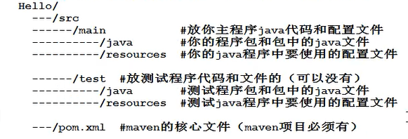
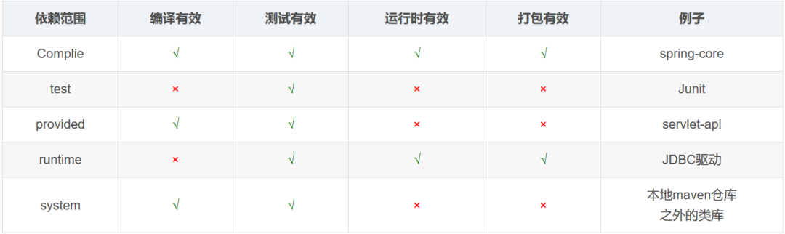

# <center>Maven</center>
## 介绍
### maven是什么？
它是个项目管理和构建的自动化工具。我们比较关心的是它构建项目的能力。

### maven能干什么
1. **自动下载jar包**：先从本地仓库中找，如果没有，先去中央仓库找，再去远程仓库（有的话），找到就下载到本地仓库，否则抛异常。
2. **处理jar包的依赖**：如果a.jar需要b.jar, maven会自动下载b.jar。
3. **管理jar包版本**，更新jar包等等。
4. **编译java文件**：将java程序编译成.class文件，批量处理的（同时处理成千上百个）。
5. **测试代码**。
6. **打包文件**：打包成jar文件，或者war文件。
7. **部署项目**。

## 使用
ps：默认maven已经安装了

[maven实践-简单项目构建](maven_bulid.md)

[maven常用操作](maven.md)
## 讲解
### maven构建过程
1. 清理：将之前项目编译的东西删除掉，为新编译的代码做准备。
2. 编译：将Java代码编译成.class文件
3. 测试：批量测试程序代码，验证程序正确性。
4. 报告：生成测试报告文件。
5. 打包：将你项目中的所以的class文件和配置文件等所有资源打包到压缩包里，一般是jar包里。
6. 安装：把5中生成的文件jar/war安装到本机仓库。
7. 部署，把程序安装好，可执行。

### maven核心概念
1. [POM](#POM)
2. [约定的目录结构](#约定的目录结构)
3. [坐标](#坐标)
4. [依赖管理](#依赖管理)
5. [仓库管理](#仓库管理)
6. [生命周期](#生命周期)
7. [插件和目标](#插件和目标)
8. [继承](#继承)
9. [聚合](#聚合)

#### POM
POM即project object model，项目对象模型。

```
<project xmlns="http://maven.apache.org/POM/4.0.0"
         xmlns:xsi="http://www.w3.org/2001/XMLSchema-instance"
         xsi:schemaLocation="http://maven.apache.org/POM/4.0.0
            http://maven.apache.org/xsd/maven-4.0.0.xsd">
    <modelVersion>4.0.0</modelVersion>

    <!-- 基本配置 -->
    <groupId>...</groupId>
    <artifactId>...</artifactId>
    <version>...</version>
    <packaging>...</packaging>


    <!-- 依赖配置 -->
    <dependencies>...</dependencies>
    <parent>...</parent>
    <dependencyManagement>...</dependencyManagement>
    <modules>...</modules>
    <properties>...</properties>

    <!-- 构建配置 -->
    <build>...</build>
    <reporting>...</reporting>

    <!-- 项目信息 -->
    <name>...</name>
    <description>...</description>
    <url>...</url>
    <inceptionYear>...</inceptionYear>
    <licenses>...</licenses>
    <organization>...</organization>
    <developers>...</developers>
    <contributors>...</contributors>

    <!-- 环境设置 -->
    <issueManagement>...</issueManagement>
    <ciManagement>...</ciManagement>
    <mailingLists>...</mailingLists>
    <scm>...</scm>
    <prerequisites>...</prerequisites>
    <repositories>...</repositories>
    <pluginRepositories>...</pluginRepositories>
    <distributionManagement>...</distributionManagement>
    <profiles>...</profiles>
</project>
```


#### 约定的目录结构
每一个maven项目在磁盘里都是一个文件夹(以Hello项目为例)


idea中还会有个.iml文件，它是idae项目的标识文件。iml即infomation  of  module。

在Maven中，项目的依赖关系在pom.xml文件中指定。在IntelliJ IDEA中，即使对于Maven项目，相同的信息也存储在iml文件中。

IDEA并不直接理解Maven模型，它将其转换为所有子系统使用的idea本身的项目模型，所以可以在IDEA中构建/运行/测试/部署/调试Maven项目，而无需使用Maven。它比直接读取Maven模型更快，更容易维护。

#### 坐标
~~~~
<dependencies>
    
    <dependency>
        <groupId>junit</groupId>
        <artifactId>junit</artifactId>
        <version>4.11</version>
        <scope>test</scope>
    </dependency>
    
    <dependency>
        <groupId>mysql</groupId>
        <artifactId>mysql-connector-java</artifactId>
        <version>5.1.9</version>
    </dependency>


</dependencies>
~~~~

在 dependencies 标签中，添加项目需要的 jar 所对应的 maven 坐标。

* dependency：
一个 dependency 标签表示一个坐标

* groupId：
团体、公司、组织机构等等的唯一标识。团体标识的约定是它以创建这个项目的组织名称的逆向域名（例如 org.javaboy）开头。一个 Maven 坐标必须要包含 groupId。一些典型的 groupId 如 apache 的 groupId 是 org.apache.

* artifactId：
相当于在一个组织中项目的唯一标识符。

* version：
一个项目的版本。一个项目的话，可能会有多个版本。如果是正在开发的项目，我们可以给版本号加上一个 SNAPSHOT，表示这是一个快照版（新建项目的默认版本号就是快照版）

* scope：
表示依赖范围。


找依赖要用到jar包，用 mvnrepository.com，下载到本地仓库。

#### 依赖管理

#### 仓库管理

#### 生命周期
Maven生命周期定义了各个构建环节的执行顺序，有了这个清单，Maven就可以自动化执行构建命令了。

Maven有三套相互独立的生命周期，分别是
1. Clean Lifecycle 在进行真正的构建之前进行一些清理工作
2. Default Lifecycle: 构建的核心部分，包含 编译，测试，打包，安装和部署等。
3. Site Lifecycle： 生成项目报告，站点，发布站点。

>他们是相互独立的，你可以仅仅执行mvn clean来清理工作目录，仅仅调用mvn site来生成站点。也可以这样执行mvn clean install site运行所有这三套生命周期。

```
Clean生命周期一共包含三个阶段：
1）pre-clean： 执行一些需要在clean之前完成的工作
2）clean：移除所有上一次构建生成的文件
3）post-clean: 执行一些需要在clean之后立刻完成的工作

Default生命周期是Maven生命周期中最重要的一个，绝大部分工作都发生在这个生命周期中。
这里只列出一部分重要和常用的阶段。
1）validate
   包含generate-sources和process-source两个动作，
   也就是复制并处理资源文件，至目标目录，准备打包。
2）compile 编译项目源码
   包含process-class generate-test-sources 
   generate-test-resources process-test-resources
   复制并处理资源文件，至目标测试目录。
3）test-compile：编译测试源代码
   包含process-test-classes 和prepare-package
4）package 接受编译好的代码，打包成jar或者war
   包含pre-integration-test和integration-test和verify
5）install 将包安装到本地仓库，以让其他项目依赖。
6）deploy 将最终的包复制到远程的仓库，以让其他开发人员与项目共享或部署到服务器上运行。

site的生命周期：
1）pre-site：执行一些需要在生成站点文档之前完成的工作。
2）site:生成项目的站点文档
3）post-site：执行一些需要在生成站点文档之后完成的工作，为部署做准备
4）site-deploy：将生成的站点文档部署到特定的服务器上。
工作中可能经常用到的是site阶段和site-deploy阶段，用来生成和发布maven站点。
这个功能相当强大，经理比较喜欢这个，文档和统计数据自动生成，很好看。
```

#### 插件和目标

#### 继承

#### 聚合
